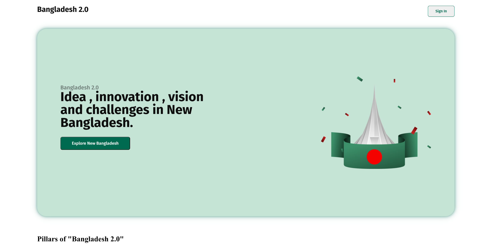
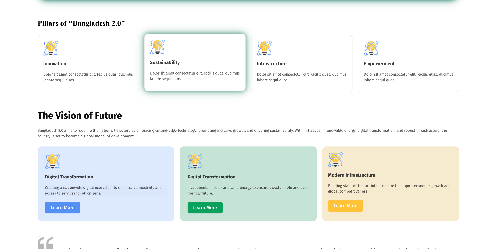
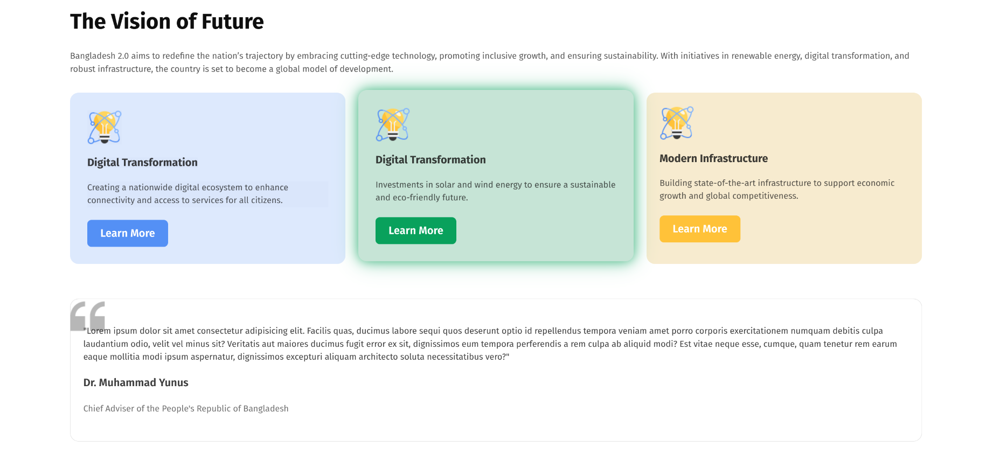

# 🇧🇩 Bangladesh 2.0

**Bangladesh 2.0** is a modern, responsive web project that presents a visionary concept for the future of Bangladesh. The site is designed with a focus on innovation, sustainability, infrastructure, and empowerment — showcasing ideas that represent a roadmap toward a prosperous future.

This project serves as both a conceptual design and a demonstration of web development skills including HTML, CSS, and modern responsive design principles.

---

## 🌟 Features

- **Responsive Design:** Optimized for various screen sizes.
- **Modern UI:** Clean layout with eye-catching animations.
- **Vision-Oriented Content:** Dedicated sections for innovation, sustainability, and infrastructure.
- **Interactive Elements:** Hover effects, animated banners, and styled buttons.
- **Custom Footer:** Creative animated gradient footer for aesthetic appeal.

---

## 🚀 Live Demo

🔗 **View Website:** [shoaibtaimur.github.io/first-personal-portfolio](https://shoaibtaimur.github.io/bangladesh-2.0/)

---

## 🛠️ Technologies Used

- **HTML5**
- **CSS3** (including Flexbox and Grid layout)
- **Google Fonts** (`Fira Sans`)
- Responsive and modern styling techniques

---

## 📂 Project Structure

```

Bangladesh-2.0/
│
├── index.html         # Main HTML file
├── CSS/
│   └── index.css      # Stylesheet
├── assets/
│   ├── hero.png       # Banner image
│   ├── card-icon.png  # Icons for pillars and vision
│   └── quote-bg.png   # Quote section background
└── README.md

```

---

## 🚀 Installation & Usage

1. **Clone the Repository**
   git clone https://github.com/YourUsername/Bangladesh-2.0.git

2. **Open in Browser**
   Navigate to the project folder and open `index.html` in your preferred browser.

3. **Edit & Customize**
   Modify the HTML and CSS to fit your vision or expand functionality.

---

## 🎯 Project Goals

The aim of Bangladesh 2.0 is to:

- Showcase how a modern web design can represent a visionary concept.
- Demonstrate a clean and user-friendly layout.
- Inspire creativity in web development projects.
- Blend aesthetics with functionality.

---

## 📸 Preview





---

## 📜 Credits

- **Design & Development:** MD Shoaib Taimur
- **Fonts:** [Google Fonts — Fira Sans](https://fonts.google.com/specimen/Fira+Sans)
- **Icons & Images:** Custom created for the project.

---

## 📌 License

This project is licensed under the MIT License. See the LICENSE file for details.

---

💡 _Bangladesh 2.0 — a vision of innovation, sustainability, and progress._
